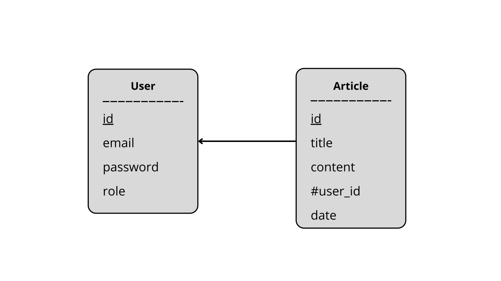

### Le but du projet

Notre projet consiste à développer la démo d'une application web Symfony avec authentification, vérification de compte par email, login/logout et accès restreints aux ressources. Nous avons choisi le sujet Content Management System (CMS).

## Table des matières
- [Équipe](#équipe)
- [Pré-requis](#pré-requis)
- [Modèle Conceptuel de données](#modèle-conceptuel-de-données)
- [Configuration](#configuration)
- [Installer](#installer)
- [Lancer le projet](#lancer-le-projet)
- [Arreter le projet](#arreter-le-projet)
- [Ressources utiles](#ressources-utiles)

# Équipe

Notre mini équipe est composée de Lukas GABORIAU et Mathilde SIMON !

# Pré-requis

- Installer Docker+Compose;
- Installer Composer;
- Installer le gestionnaire de projet Symfony.

# Modèle Conceptuel de données
Le MCD de ce projet est très simple, il contient simplement une table **user** et **article**.
- **user** : représente un utilisateur du site
- **article** : représente un article publié sur le site.

Un utilisateur peut avoir rédigé plusieurs ou aucun article et chaque article n'appartient qu'à un utilisateur !

# Configuration

Vérifier les ports publiés pour les services (conteneurs) de postgresql et de mailpit et les adapter au besoin.

# Installer

Changer les ports situer à:
- compose.yaml

~~~bash
composer install
docker compose up -d
php bin/console doctrine:migrations:migrate
~~~

Commande pour migrer une version spécifiques
~~~bash
php bin/console doctrine:migrations:execute --up DoctrineMigrations\Version20250424162117
~~~

# Lancer le projet

~~~bash
docker compose up -d
symfony server:start -d
~~~

# Arreter le projet

~~~bash
symfony server:stop
~~~

# Ressources utiles

- [Security](https://symfony.com/doc/current/security.html), point d'entrée de la doc Symfony sur la sécurisation des sites web;
- [Sending Emails with Mailer]( https://symfony.com/doc/current/mailer.html), documentation Symfony sur la configuration du service *mailer* (envoi de mail)
- [Flash Messages](https://symfony.com/doc/current/session.html#flash-messages), documentation Symfony sur les messages flash (des messages à n'afficher qu'une fois), utile pour afficher une notice après une redirection par exemple
- [Firewall](https://symfony.com/doc/current/security.html#the-firewall), documentation Symfony sur le concept de *firewall* (pare-feu). Un firewall définit les routes protégées par authentification et le mode d'authentification
- [Access control](https://symfony.com/doc/current/security.html#access-control-authorization), documentation Symfony sur la protection des ressources par authentification, role, etc.
- [Using Expressions in Security Access Controls](https://symfony.com/doc/current/security/expressions.html), documentation Symfony sur la possibilité d'appliquer des restrictions d'accès à des ressources utilisant de la logique custom via des expression