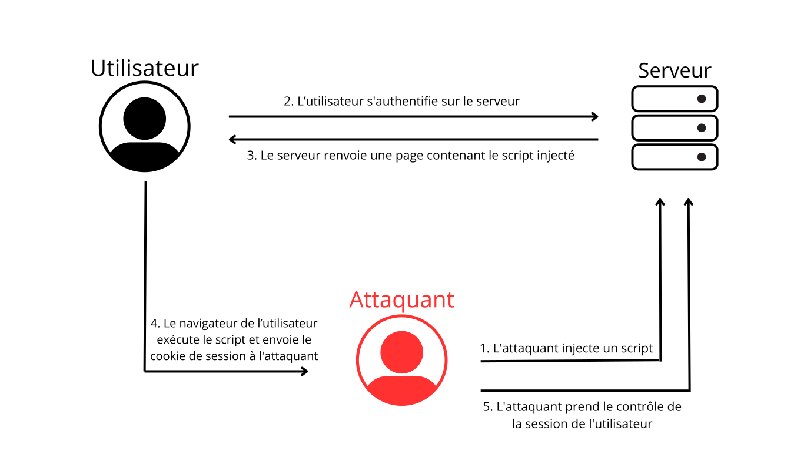
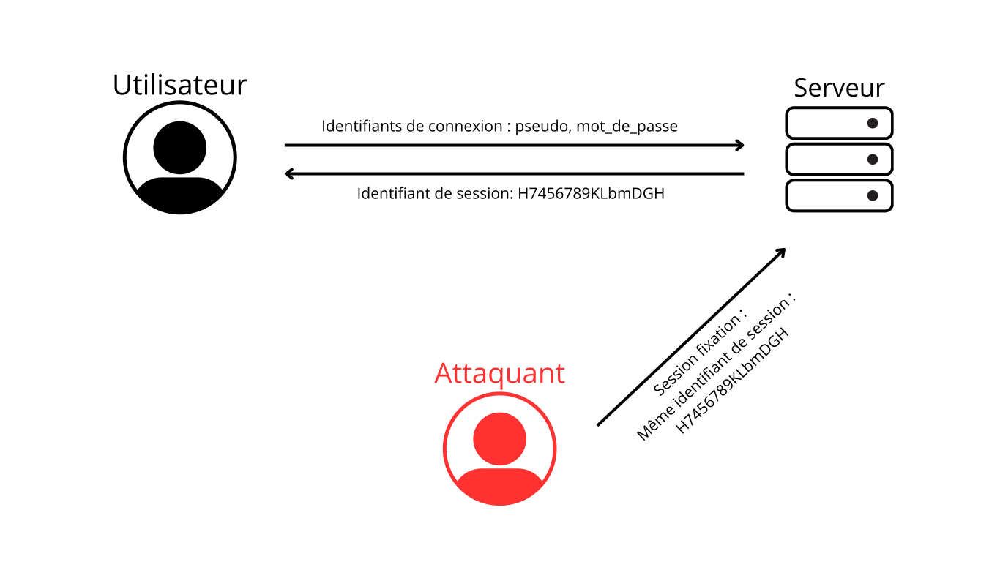

# schéma du pattern MVC

# Les sessions
### Qu'est-ce qu'une session dans le cadre d'une application web ?

Dans le cadre des applications web, une session est le mécanisme utilisé pour conserver les informations relatives d'un utilisateur tout au long de sa présence sur le site web, par exemple, si un utilisateur se connecte à son compte, la session va permettre de se souvenir de son identité même s'il change de page sur le site.
Une session peut contenir plusieurs interactions comme la consultation de différentes pages, l'ajout d'articles à un panier, ou l'accès à des contenus réservés, etc. 

# Les attaques
### Session hijacking

La session hijacking est une attaque où un pirateur vole le cookie de session d'un utilisateur authentifié pour accéder à son compte sans connaître son mot de passe. Il peut être utilisé pour accéder à des fonctionnalités privées ou pour voler des informations sensibles.
Voici une exemple d'attaque grâce au schéma :

### Session fixation

La session fixation est une attaque où un pirateur force un utilisateur à utiliser un identifiant de session que le pirateur a défini lui même sur le site. Dans le schéma ci-dessous, on voit que le pirateur crée un identifiant de session valide (SessionID: H7456789KLbmDGH) et fait en sorte que l'utilisateur l'utilise en lui envoyant par exemple un lien piégé, un mail, QR Code, etc... L'utilisateur se connecte avec ce lien et le pirateur peut alors accéder à son compte. 
